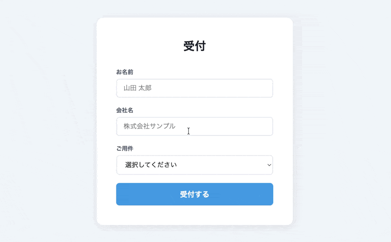

Laravel を vibe coding で触ってみただけの学習用テストです。

# 受付アプリ

Laravel で作ったシンプルな来客受付管理アプリです。



## 機能

- **受付フォーム** (`/`) - 来客が名前・会社名・用件を入力して受付
- **呼出画面** (`/reception/{id}/calling`) - 受付完了後の確認画面（5秒で自動遷移）
- **受付一覧** (`/reception`) - 管理者のみ閲覧可能（要ログイン）
- **受付の削除** - 一覧画面から受付を削除できる
- **Slack 通知** - 受付登録時に Slack チャンネルへ自動通知

## 認証

受付一覧は管理者のみアクセスできます。未ログインの場合はログイン画面にリダイレクトされます。

受付フォームと呼出画面は誰でもアクセスできます。

### 管理者アカウント

| メール | パスワード |
|---|---|
| admin@example.com | password |

## Slack 通知の設定

受付が登録されると Slack に通知を送れます。設定しなくても動作します。

1. [Slack API](https://api.slack.com/apps) でアプリを作成し、Incoming Webhooks を有効化
2. Webhook URL を取得
3. `.env` に追加：

```
SLACK_WEBHOOK_URL=https://hooks.slack.com/services/XXXXX/YYYYY/ZZZZZ
```

## セットアップ

```bash
# 依存パッケージのインストール
composer install

# .env ファイルの作成
cp .env.example .env
php artisan key:generate

# データベースのマイグレーションとシード
php artisan migrate
php artisan db:seed

# 開発サーバーの起動
php artisan serve
```

http://localhost:8000 でアクセスできます。

## 技術スタック

- PHP / Laravel
- SQLite
